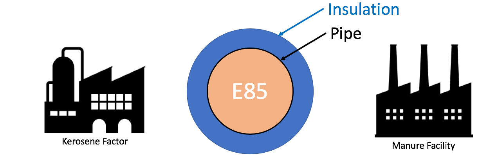

## At a Glance

|Questions|Objectives|Key Points|
|:--------|:---------|:---------|
|What is a numerical algorithm?|Implement a simple numerical algorithm.<br>Use it to solve a simple science poblem.|Numerical Packages are used<br>to solve scientific problems<br>involving [PDEs.][PDE]|
|What is [discretization][DISC]?|Introduce basic concepts in solving continous<br>[PDEs][PDE] using discrete computations.|_Meshing_ (or [discretization][DISC]) is an<br>important first step.|
|How can numerical packages<br>help me with my software?|Understand the value numerical packages<br>offer in developing science applications|Numerical packages offer many advantages<br>including: rigorous/vetted numerics<br>increased generality, extreme scalability,<br>performance portability, enhanced reproducibility<br>and many others...|

### To begin this lesson...

* [Open the Answers Form](https://docs.google.com/forms/d/e/1FAIpQLSdoyXOL4UCe4_p0SheNidqY_ErKcrRS2qqqomIHQMZi5eVM2g/viewform?usp=sf_link){:target="_blank"}
* Go to the directory for the hand-coded `heat` application
```
cd {{ site.handson_root }}/hand_coded_heat
```

[//]: # (Example below, commented out of the kramdown, is embedded form)
[//]: # (<iframe src="https://docs.google.com/forms/d/e/1FAIpQLSdoyXOL4UCe4_p0SheNidqY_ErKcrRS2qqqomIHQMZi5eVM2g/viewform?embedded=true" width="700" height="520" frameborder="0" marginheight="0" marginwidth="0">Loading...</iframe>)

## A Simple Science Question

Lets say you live in a house with exterior walls made of a single material of thickness, $$L_x$$.
Inside the walls are some water pipes as pictured below.

|[](wall_and_pipe.png)|

You keep the inside temperature of the house always at 70 degrees F. But, there is an
overnight storm coming. The temperature is expected to drop to -40 degrees F. Will your
pipes freeze before the storm is over?

### Governing Equations

In this lesson, we demonstrate the implementation and use of a hand-coded
(e.g., does not use any numerical packages) C-language application to
model the one dimensional _heat_ condution equation through a wall as
pictured here ...

In general, heat [conduction](https://en.wikipedia.org/wiki/Thermal_conduction) is governed
by the partial differential ([PDE][PDE])...

$$\frac{\partial u}{\partial t} - \nabla \cdot \alpha \nabla u = 0$$

where _u_ is the temperature within the wall at spatial positions, _x_, and times, _t_, \\( \alpha \\),
is the _thermal diffusivity_
of the material(s) comprising the wall. This equation is known as the
_Diffusion Equation_ and also the [_Heat Equation_](https://en.wikipedia.org/wiki/Heat_equation).

---

### Simplifying Assumptions

To make the problem tractable for this short lesson, we make some simplifying assumptions...

1. The thermal diffusivity, \\( \alpha \\)
   is constant for all _space_ and _time_.
1. The only heat _source_ is from the initial and/or boundary conditions.
1. We will deal only with the _one dimensional_ problem in _Cartesian coordinates_.
1. We will _[discretize][DISC]_ with constant spacing in both space, $$\Delta x$$ and time, $$\Delta t$$.

In this case, the [PDE][PDE] we need to develop an application to solve simplifies to...

$$\frac{\partial u}{\partial t} = \alpha \frac{\partial^2 u}{\partial x^2}$$

## [Discretization][DISC]

The equation above is a _continous_,
[partial differential equation (PDE)][PDE]
In order to write a computer program to solve this equation, numerically, the first thing
we need to consider is how to _[discretize][DISC]_
the equation into a form suitable for numerical computation.

Consider discretizing, independently, the left- and right-hand sides of
equation 2. For the left-hand side, we can approximate the first derivative
of _u_ with respect to time, _t_, by the equation...

$$\frac{\partial u}{\partial t} \Bigr\vert_{t_{k+1}} \approx \frac{u_i^{k+1}-u_i^k}{\Delta t}$$

We can approximate the right-hand side of equation 2 with
the second derivative of _u_ with respect to space, _x_, by the equation...

$$\alpha \frac{\partial^2 u}{\partial x^2}\Bigr\vert_{x_i} \approx \alpha \frac{u_{i-1}^k-2u_i^k+u_{i+1}^k}{\Delta x^2}$$


Setting equations 3 and 4 equal to each other and re-arranging terms, we
arrive at the following update scheme for producing the temperatures at
the next time, _k+1_, from temperatures at the current time, _k_, as

$$u_i^{k+1} = ru_{i+1}^k+(1-2r)u_i^k+ru_{i-1}^k$$

where \\( r=\alpha\frac{\Delta t}{\Delta x^2} \\)

{% include qanda
    question='Is there anything here that looks like a _mesh_?'
    answer='
In the process of discretizing the [PDE][PDE], we have defined a fixed spacing in x
and a fixed spacing in t as shown in the figure here

{:height="320px" align="center" width="320px"}

This is essentially a uniform mesh. Later lessons
here address more sophisticated discretizations in space and in time which
depart from these all too inflexible fixed spacings.
                                                                          
                                                                          
                                                                          
                                                                          
                                                                          
' %}

Note that this equation now defines the solution at spatial position _i_ and time _k+1_
in terms of values of u at time _k_ .  This is an
[_explicit_](https://en.wikipedia.org/wiki/Explicit_and_implicit_methods)
numerical method known as the
_[forward in time, centered difference (FTCS)](https://en.wikipedia.org/wiki/FTCS_scheme)_
 algoritm. As an explicit method, it has some nice properties:

* They are easy to implement.
* They typically require minimal memory.
* They are easy to parallelize.

## Exercise #1 (2 mins)

The function, `solution_update_ftcs`, is defined below without its body.

```c
static void
solution_update_ftcs(
    int n,              // # of temperatur samples in space
    Double *curr,       // new temperatures to be computed
    Double const *last, // old/last temperatures computed
    Double alpha,       // thermal diffusivity
    Double dx,          // spacing in space, x
    Double dt,          // spacing in time, t
    Double bc_0,        // boundary condition @ x=0
    Double bc_1         // boundary condition @ x=Lx
)
{
```
{% include qanda
    question='Using eq. 5, implement the body of this function'
    answer='
```
    Double const r = alpha * dt / (dx * dx);

    // Sanity check for stability
    if (r > 0.5) return false;

    // Update the solution using FTCS algorithm
    for (int i = 1; i < n-1; i++)
        curr[i] = r*last[i+1] + (1-2*r)*last[i] + r*last[i-1];

    // Impose boundary conditions for solution indices i==0 and i==n-1
    curr[0  ] = bc_0;
    curr[n-1] = bc_1;

    return true;
```
                                                                      
                                                                      
                                                                      
                                                                      
' %}

```
}
```

Open ftcs.C and implement the FTCS numerical algorithm by coding the body of this function.

## Exercise #2: Build and Test the Application (1 min)

### Compiling heat.c

To compile the code you have just written...

```
make
```

### Testing The `heat` Application

Before we use our new application to solve our simple science question, how can we assure
ourselves that the code we have written is correct?



We have defined a known numerical result in `heat_soln_check.curve` for the case of
$$L_x = 1$$, $$u(0,t) = 0$$, $$u(1,t) = 1$$. We have defined convenient way of testing
against this result.  To run your new application and compare its results to this known
result, simly run 

```
make check
```

#### The `check` make target

The make _target_ `check` (or sometimes `test`) is a standard community adopted
standard target for numerical packages to define in order to perform simple tests and 
checks that the compiled software is actually operating as expected.

#### The `--help` command line argument

Another common practice in developing numerical packages is to provide a means for
users to obtain help by simply running the application with `--help` command-line
argument.

At any point, you can get help regarding various options `heat` like so...
```
Usage: ./heat <arg>=<value> <arg>=<value>...
    runame="heat"                       name to give run and results dir (char*)
    alpha=0.2           material thermal diffusivity (sq-meters/second) (double)
    lenx=1                                     material length (meters) (double)
    dx=0.1                  x-incriment. Best if lenx/dx==int. (meters) (double)
    dt=0.004                                      t-incriment (seconds) (double)
    maxt=2         >0:max sim time (seconds) | <0:min l2 change in soln (double)
    bc0=0                     boundary condition @ x=0: u(0,t) (Kelvin) (double)
    bc1=1               boundary condition @ x=lenx: u(lenx,t) (Kelvin) (double)
    ic="const(1)"               initial condition @ t=0: u(x,0) (Kelvin) (char*)
    alg="ftcs"                            algorithm ftcs|upwind15|crankn (char*)
    savi=0                                   save every i-th solution step (int)
    save=0                              save error in every saved solution (int)
    outi=100                      output progress every i-th solution step (int)
    noout=0                                       disable all file outputs (int)
    prec="double"                       precision half|float|double|quad (char*)
Examples...
    ./heat dx=0.01 dt=0.0002 alg=ftcs
    ./heat dx=0.1 bc0=273 bc1=273 ic="spikes(273,5,373)"
```

See the note below regarding more information on the `ic` argument to
specify an initial condition.

## Exercise #3 Do Some Simple Science (4 mins)

Lets now use our `heat` application to solve our simple science question.

### Additional Information / Assumptions

|Material|Thermal Diffusivity<br>(sq-meters/second)|
|Wood|$$8.2 \times 10^{-8}$$|
|Adobe Brick|$$2.7 \times 10^{-7}$$|
|Common (red) Brick|$$5.2 \times 10^{-7}$$|

* Outside temp has been same as inside temp for a long time, 70 degrees F
* Night/Storm will last 15.5 hours @ -40 degrees F
* Walls are 0.25 meters thick wood
* Pipe will freeze if center point drops below freezing.

**Note:** An all too common issue in simulation applications is being sure data is
input in the correct units. Take care!



----

## Evening Hands On Session

### Determine Optimum Wall Thicknesses

What are the minimium thicknesses of walls of Wood, Adobe and Common brick
to prevent the pipes from freezing?

### Compare FTCS, Crank-Nicholson and Upwind15 Algorithms

#### [Crank-Nicolson](https://en.wikipedia.org/wiki/Crank–Nicolson_method) Discretization

Using the [Crank-Nicolson](https://en.wikipedia.org/wiki/Crank–Nicolson_method) discretization,
we arrive at the following discretization of equation 2...

$$-ru_{i+1}^{k+1}+(1+2r)u_i^{k+1}-ru_{i-1}^{k+1} = ru_{i+1}^k+(1-2r)u_i^k+ru_{i-1}^k$$

where

$$r= \alpha \frac{\Delta t}{2 \Delta x^2}$$

In equation 7, the solution at spatial position _i_ and time _k+1_
now depends not only on values of u at time _k_ but also on other
values of u at time _k+1_.
This means each time we advance the solution in time we must
solve a linear system; in other words we must solve for all of the
values at time _k+1_ in one step.
This is an example of an [_implicit_](https://en.wikipedia.org/wiki/Explicit_and_implicit_methods) method.
In this case, the system of equations is [_tri-diagonal_](https://en.wikipedia.org/wiki/Tridiagonal_matrix_algorithm) --
since each update for u at _i_ only uses u at _i-1_ , _i_ and _i+1_ --
so it is easier to implement than a general matrix solve but is still more complicated
than an explicit update.

The code to implement this method is more involved because it involves
doing a tri-diagonal solve. It is in `crankn.C`. It involves code that
sets up and LU factors the initial matrix. Then, the LU factored matrix
is used on each solution timestep to solve for the new temperatures.

Run the same problems using each of these algorithms and observe total
memory usage and operation counts (printed at the end).

### Use The Application to Solve The Pipeline Problem

|[](pipeline.png)|

An pipeline carrying Ethenol-85 (E85) runs between a manuer processing
facility and a kerosene production factory. In the unlikely event that
both facilities experience catastrophic explosion (burning methane at
the manuer facility and burning kerosene at the kerosene facility),
that _briefly_ increases the local air temperature on both sides of
the pipe to the burning temperature of the respective materials, determine
the minimum thermal diffusivity of the material used to coat/insulate the pipe
to prevent the E-85 from exploding.

### Modify the Application to Support Two Materials

### A note about the `ic=` argument to `heat` 

The initial condition argument, `ic`, handles a few interesting cases

Constant, `ic="const(V)"`

: Set initial condition to constant value, `V`

Ramp, `ic="ramp(L,R)"`

: Set initial condition to a linear ramp having value `L` @ x=0 and `R` @ x=$$L_x$$.

Step, `ic="step(L,Mx,R)"`

: Set initial condition to a step function having value `L` for all x<Mx and value `R` for all x>=Mx.

Random, `ic="rand(S,A)"`

: Set initial condition to random values between 0 and `A` using seed value `S`.

Sin, `ic="sin(Pi*x)"`

: Set initial condition to $$sin(\pi x)$$. 

Spikes, `ic="spikes(C,A0,X0,A1,X1,...)"`

: Set initial condition to a constant value, `C` with any number of _spikes_ where each spike is the pair, `Ai` specifying the spike amplitude and `Xi` specifing its position in, x.

[PDE]: https://en.wikipedia.org/wiki/Partial_differential_equation
[DISC]:https://en.wikipedia.org/wiki/Discretization
